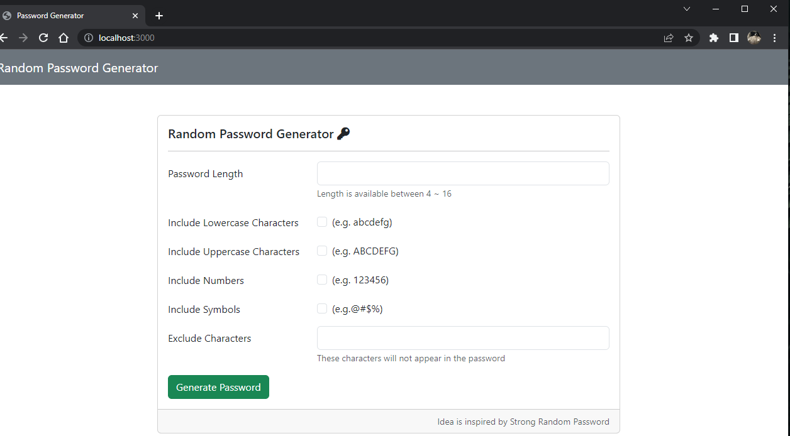

# URL Shortener
#### This's a simple web tool to randomly generate password.

## ScreenShot

---

## Features
---
* Allow users to convert URL to a short version.
* There's a copy button to copy the new URL for users.
* There's a redirect button for users to gernerate new URL.

##  Requirement 
---
* body-parser:^1.20.2
* mongoose:5.9.7
* valid-url:1.0.9
* express:4.18.2
* express-handlebars:4.0.2

## Installation & Execution 
1. Use CMD to clone the code to local
git clone https://github.com/SmallRG/URLShortener

2. Change to the target directory.
3. Install the requirements:
npm install + requirment_name
4. Start the Server:
npm run dev